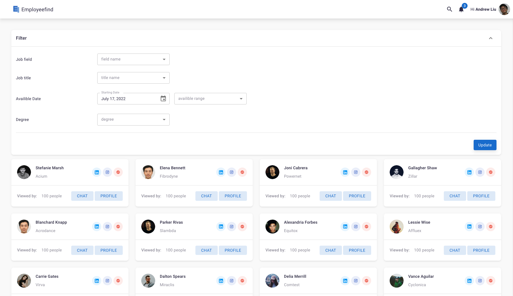
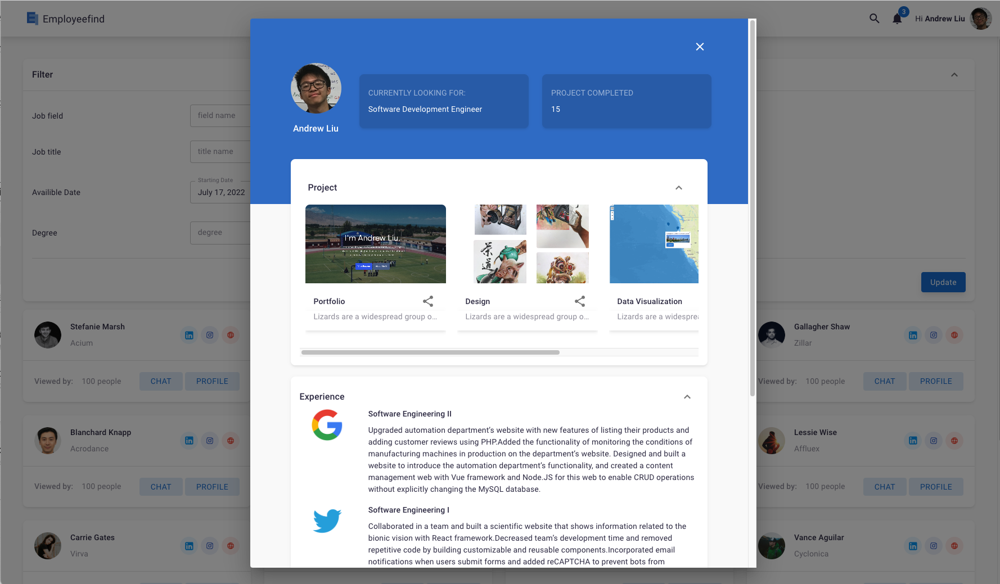

# Employeefind-Front end

link: https://62c717173e6d8411c34decbf--meek-lamington-f0bfb6.netlify.app/dashboard/default

Starting from summer 2021, My friend and I began to build Employeefind, a platform that helps employers find suitable employees in an fast and intelligent way. This repository contains the front-end source code for the platform (The interface is constantly updated)

## Preview

1. home page
   <br/><br/>
   
   <br/><br/>
2. user profile page
   

## Development

1. download all necessary npm packages

```
$ npm install
```

2. run the project

```
$ npm run start
```

To build the production files, run the following:

```
$ npm run build
```

The production files will be in the `dist/` folder.

## About Author

Andrew Liu, https://andrew-liu.co/
